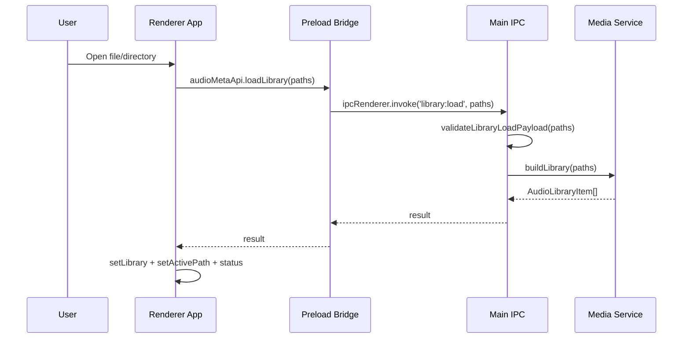
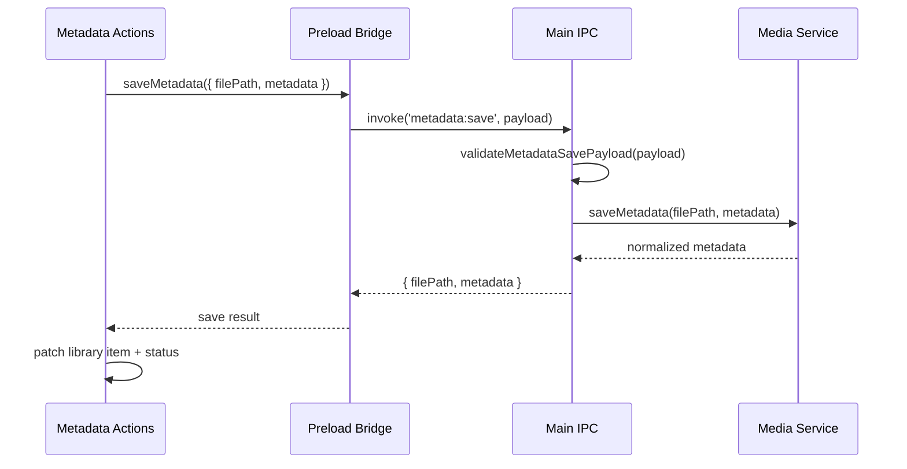
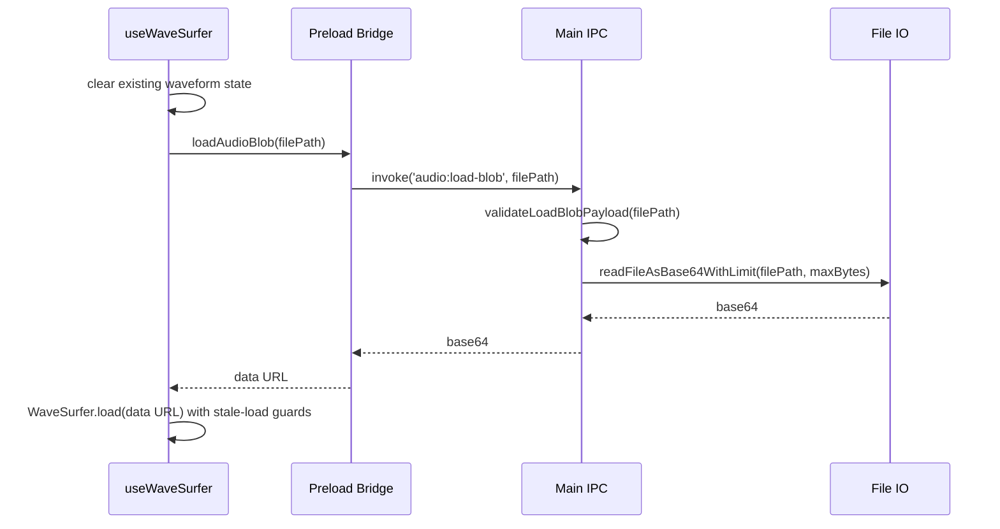
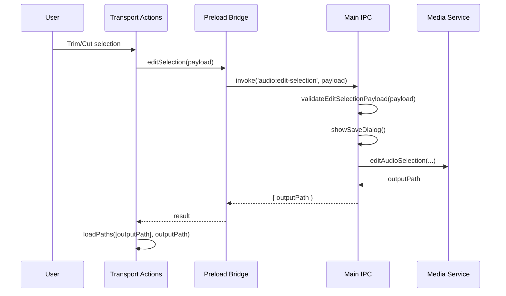

# Architecture

This document captures the current production architecture and the decisions behind it.

## System Overview

AudioMetaEditor is split into three runtime boundaries:

1. Electron main process (`electron/main.js` and backend helpers)
2. Electron preload bridge (`electron/preload.js`)
3. React renderer (`src/**`)

Main owns privileged operations. Preload exposes a typed and constrained API. Renderer owns UX, state orchestration, and waveform behavior.

## Module Boundaries

### Main process

- `electron/main.js`
  Responsibilities:
  Lifecycle, window creation, `audio-meta://` protocol, IPC registration, dialog orchestration, and launch/open-path handling.

- `electron/media-service.js`
  Responsibilities:
  Library scan, metadata extraction, metadata write, clip export/edit via ffmpeg.

- `electron/ipc-validators.js`
  Responsibilities:
  Runtime validation for incoming IPC payloads before any side effect.

- `electron/file-io.js`
  Responsibilities:
  Bounded file-to-base64 reads for waveform load path, including size guard.

- `electron/main-utils.js`
  Responsibilities:
  Shared path and URL helpers used by main and covered by smoke tests.

### Preload

- `electron/preload.js`
  Responsibilities:
  `window.audioMetaApi` bridge exposure, action logging, renderer event subscriptions.

### Renderer

- `src/App.tsx`
  Responsibilities:
  Top-level composition and wiring of feature hooks into panes.

- `src/services/audioMetaApi.ts`
  Responsibilities:
  Single bridge accessor/guard used by renderer code.

- `src/ipc/contracts.ts`
  Responsibilities:
  Shared bridge contract types used across renderer and window typing.

- `src/features/library/*`
  Responsibilities:
  Library loading, desktop bridge subscriptions, session restore, and derived album metadata.

- `src/features/metadata/*`
  Responsibilities:
  Track metadata save and album-level bulk metadata application.

- `src/features/player/*`
  Responsibilities:
  Export, trim/cut, move-track, and URL download orchestration.

- `src/hooks/useWaveSurfer.ts`
  Responsibilities:
  WaveSurfer setup/teardown, region state, loop behavior, and guarded async load flow.

## Core Decisions (ADR Summary)

### ADR-001: Keep native access behind preload bridge

Status: Accepted
Reason:
Maintains renderer isolation and constrains privileged APIs to a reviewable surface.
Consequences:
Any new native feature must be added in main, preload, and typed contracts.

### ADR-002: Validate all IPC payloads in main process

Status: Accepted
Reason:
Prevents malformed renderer payloads from reaching filesystem or ffmpeg calls.
Consequences:
Every IPC handler should invoke a validator before business logic.

### ADR-003: Normalize renderer error messages

Status: Accepted
Reason:
IPC errors include channel context that is useful for debugging but noisy for users.
Consequences:
Renderer maps channel-prefixed errors into user-first status strings while preserving channel suffix.

### ADR-004: Keep waveform loading bounded

Status: Accepted
Reason:
Large in-memory base64 conversion can exhaust memory and destabilize UI.
Consequences:
`audio:load-blob` enforces max size and fails fast with explicit error.

### ADR-005: Keep clip edit/export non-destructive

Status: Accepted
Reason:
Safer default behavior for desktop audio tools with user-managed libraries.
Consequences:
Trim/cut/export always produce new files selected by user save dialogs.

## Data Contracts

Primary renderer models are in `src/types.ts`:

- `EditableMetadata`
- `AudioMetadata`
- `AudioLibraryItem`

Bridge payload/result contracts are in `src/ipc/contracts.ts`.

Contract rule:
Any metadata field or payload shape change must be updated in extraction, UI editing, save path, and TypeScript contracts together.

## Sequence Diagrams

### Load library flow

### Save metadata flow

### Waveform load flow

### Edit selection flow

## Troubleshooting: Preload Bridge Mismatch

Symptoms:

- `window.audioMetaApi` is undefined in renderer.
- Actions fail with desktop bridge unavailable message.
- IPC calls throw channel-prefixed errors immediately.

Checks:

1. Confirm `BrowserWindow` uses `preload: path.join(__dirname, 'preload.js')`.
2. Confirm `contextIsolation: true` and renderer does not import Electron directly.
3. Confirm `src/vite-env.d.ts` and `src/ipc/contracts.ts` match preload method names.
4. Restart app after preload edits to reload isolated context.

Recovery path:

1. Run `npm run typecheck` to detect contract drift.
2. Run `npm run tests` to verify bridge and utility regressions.
3. Add new bridge methods in order: main handler, preload exposure, contract typing, renderer usage.

## Invariants To Preserve

- Renderer never uses Node/Electron APIs directly.
- IPC handlers validate payloads before side effects.
- User-facing errors are normalized and channel-aware.
- Waveform load path remains size-guarded.
- Destructive audio operations remain opt-in and explicit.
